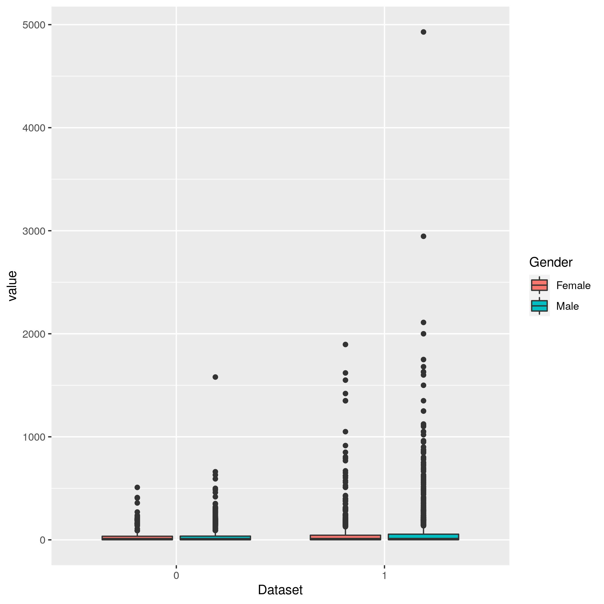
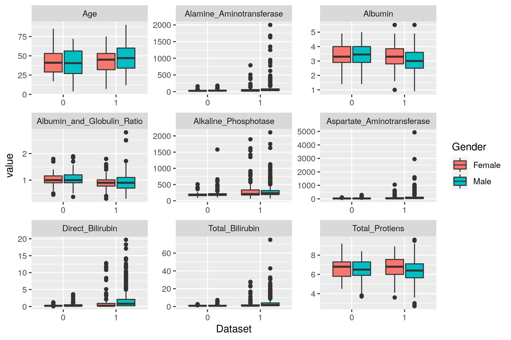
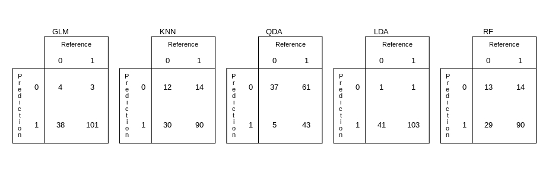

## Introduction
Liver disease, or hepatic disease, is any dysfunction in the liver that causes illness, it can be caused by genetic factors, alcohol abuse, obesity, and other conditions. Early diagnostic is crucial to the efficiency of the treatment. In this project I will use machine learn techniques to determine if a patient have or do not have a liver disease.

To do that I will use a data set collected from North East of Andhra Pradesh in India. This set contain data of 416 liver patient and 167 non liver patient. It is a table with the columns: "Age of the patient", "Gender of the patient", "Total Bilirubin", "Direct Bilirubin", "Alkaline Phosphotase", "Alamine Aminotransferase", "Aspartate Aminotransferase", "Total Protiens", "Albumin", "Albumin and Globulin Ratio" and "Dataset". Any patient whose age exceeded 89 is listed as being of age "90", there are 441 male patients and 142 female patients. The last column "Dataset" is a binary factor that divide liver disease patient (1) and non liver disease patient. The remain columns are results of blood tests.

I will chose the best variables to use in the machine learning training and write a algorithm that run in a limited computational resource.


## Methods

I downloaded the cvs archive withe the data from (https://www.kaggle.com/uciml/indian-liver-patient-records?select=indian_liver_patient.csv). First I remove 4 lines that contained NA values, then I transformed the Dataset values, that was a numeric vector with 1 for disease and 2 for non disease, in a factor vector with 1 for disease and 0 for non disease.

When it came about chronic diseases the first think people think is in the factors of age and Gender. The figure 1 is a plot of age per Dataset separated by gender, we can see that although in the median the liver disease patients are older, age is not a real good factor to determine if someone have or do not have the disease.


```{r age_gender, echo=FALSE, fig.cap="Age and gender analyses.", out.width = '100%'}

```

So I did the same plot for the blood factors, we can see all the plots  on the figure 2. We can see that the observable that have the strongest relation with the disease factor is the Albumin and Globulin Ratio, but we also can see a relation with Alkaline Phosphotase and Direct Bilirubin. Others observable that can be used Albumin and Total Protiens, but only for males, so to use this it will be necessary to use the gender as a additional observble on the training algorithm.


```{r other_factors, echo=FALSE, fig.cap="Other factors analyses.", out.width = '100%'}

```

After I decide which observable to use it's time to divide the data set in training set and test set and run the algorithms. I will use five different machine learning methods: logistic regression (GLM), k-nearest neighbor (KNN), quadratic discriminant analysis (QDA), linear discriminant analysis (LDA), random forest (RF).

## Results

After training the model and calculating the prediction with the test set I got the accuracies of 0.7192 for logistic regression (GLM), 0.6986 for k-nearest neighbor (KNN), 0.5479 for quadratic discriminant analysis (QDA), 0.7123 for linear discriminant analysis (LDA) and 0.7055 for random forest (RF).

However the data set is a binary classification so the accuracy along do not say much about the model efficiency. So I construct the confusion Matrixes for each model, figure 3. We can see that GLM and LDA was very similar in their results, both was very efficient in identify people with the liver disease, but they fail in identify the ones without the disease, that because the specificity of but models was too high, Specificity = 0.97115 for GLM and Specificity = 0.990385 for LDA. It is important to remember that the number of patients with the disease is way higher than the number of patients with no disease (416 liver patient and 167 non liver patient).

```{r CM, echo=FALSE, fig.cap="Confusion Matrixes", out.width = '100%'}

```

This fact caused a high specificity in other two methods, the KNN with specificity of 0.86538 and random forest with a specificity of 0.86538. Both had a confusion matrix very similar, they had success in identify people with liver disease, however, although they had more true negative than the GLM and LDA methods, their number of false positive was yet too high.

The method QDA had a different result, in contrast to the methods cited, it had a high sensitivity of 0.8810. As a consequence QDA was efficient in identify the true negatives, but was not that efficient in identify the liver disease patient. That is due to the fact that QDA is a kind of naive Bayes method, it tries to weight the conditional probabilities so the fact of the data set has much more liver patients than non liver patients do not interfere on the machine learning process.


##Conclusion
Early diagnostic is crucial in the treatment of liver diseases. So in this work I tried to use machine learning to identify patient with liver condition. I use five machine learning methods logistic regression (GLM), k-nearest neighbor (KNN), quadratic discriminant analysis (QDA), linear discriminant analysis (LDA), random forest (RF). In most of them the number of false positive was two high and in the QDA the number of false negative was too high, it is clear that it is a big limitation of the model. A way to make it better is use try to ensemble this methods to get better accuracy and use Bayesian theorem to try to balance the sensitivity and specificity.

